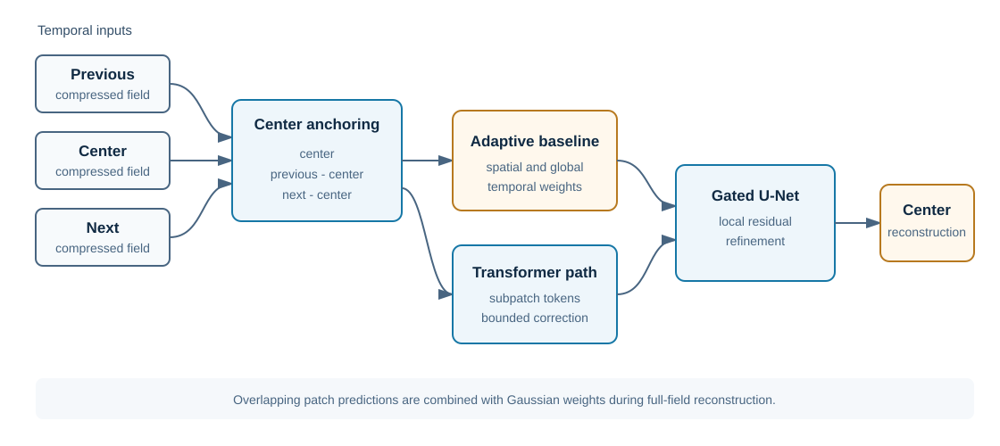

# Architecture

PTU-Net combines a temporal baseline, a patch transformer correction, and a gated U-Net refinement. It predicts the uncompressed center field from compressed fields sampled around the same timestep.

## Input representation

Let the compressed fields be \(c_{t-1}\), \(c_t\), and \(c_{t+1}\). After applying a shared scalar mean and standard deviation, the model receives three center-anchored channels:

\[
x_0 = c_t, \qquad
x_1 = c_{t-1} - c_t, \qquad
x_2 = c_{t+1} - c_t.
\]

For a batch of image patches, the input shape is `[batch, 3, patch_height, patch_width]`. The target shape is `[batch, patch_height, patch_width]`.

The original experiment uses 32 by 32 patches with stride 16. Each patch is divided into non-overlapping 8 by 8 subpatches, yielding 16 transformer tokens per patch. These are configuration defaults, not requirements of the problem definition.

## Adaptive temporal baseline

A small 1 by 1 convolutional network produces spatial temporal weights. A second learned vector provides global weights. Both are normalized with softmax and combined by a learned mixing value constrained to the interval from zero to one.

For the three-channel representation, the baseline has the form

\[
b = x_0 + w_{prev} x_1 + w_{next} x_2.
\]

This path gives the model a center-preserving starting point. The baseline parameters are initialized from the three-entry prior `(0.05, 0.90, 0.05)`. The current formula applies the first and third entries to the two difference channels. The middle entry affects those weights through softmax normalization but is not multiplied by a separate center channel term.

## Transformer correction

Each subpatch is flattened across spatial positions and input channels, projected to an embedding, and combined with a learned positional embedding. Pre-normalized self-attention and feed-forward residual blocks process the token sequence.

A linear correction head maps the tokens back to pixels. The correction is added to the temporal baseline through a learned positive scale capped by a configured maximum. With the original defaults, the embedding width is 384, the transformer has 12 attention heads and 8 layers, and the correction scale is capped at 0.2 in normalized units.

## Gated U-Net refinement

The refinement head receives the corrected prediction, temporal baseline, previous difference, and next difference. A two-level convolutional encoder and decoder uses group normalization, SiLU activations, squeeze-excitation blocks, and a gated skip connection.

The head returns a local residual and a sigmoid gate. Their product is scaled by a learned U-Net coefficient and added to the transformer output.

## Full-field reconstruction

Inference tiles a full field with overlapping patches. Patch predictions are denormalized and accumulated with a Gaussian window. The accumulated values are divided by the accumulated weights at every pixel. The patch-position routine includes bottom and right boundary patches when the dimensions are not exactly covered by the stride.

## Ablation controls

`PTUNetConfig` can disable the adaptive baseline, transformer correction, U-Net refinement, positional embedding, skip attention, or squeeze-excitation blocks. These switches make component-removal experiments explicit in a checkpoint configuration. The repository does not currently report an ablation result. A valid comparison must keep the data split, optimization budget, seeds, metric implementation, and reporting rule fixed.

## Implementation boundary

This description reflects the architecture in the original single-file implementation and the package refactor. It is not a statement of reconstruction accuracy, speed, or generalization. See [results.md](results.md) for the current evidence status and [reproducibility.md](reproducibility.md) for migration checks that remain open.
